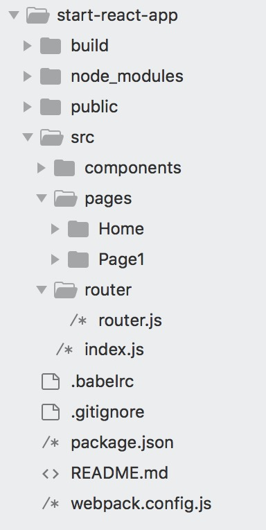

# start-react-app

1. react+webpack的一个小型结构参考了，参考了<https://www.jianshu.com/p/db6113c94dbc> 的配置，主要用于写react组件。
2. 加入了sass-loader,file-loader。
3. <del>没有加入react-router和redux等</del>加入了react-router。


##目录结构




## 使用

```
$ git clone https://github.com/hekiheki/start-react-app.git
$ npm install
$ npm start

//build
$ npm run build
```